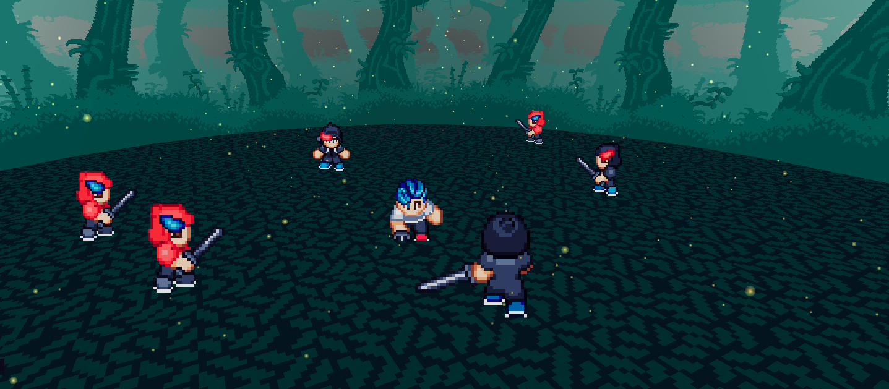

# Rtf-sprite

Playing with perspective and 2.5D in React Three Fiber

---

useAseprite hook adapted from: https://github.com/bfollington/use-spritesheet

Sprites from: https://robocelot.itch.io/gumdrop-source-and-sprites

Textures from: https://jesse-m.itch.io/jungle-pack
